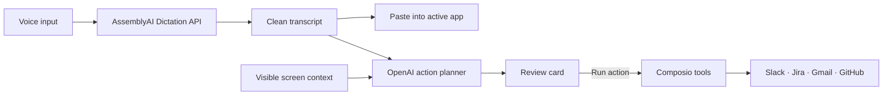

<p align="center">
  
</p>

<h1 align="center">Twin</h1>

<p align="center">
  <strong>Your voice, across your apps.</strong>
</p>

<p align="center">
  A compact Windows voice interface that turns natural speech into clean writing<br />
  and reviewable actions across the tools you already use.
</p>

<p align="center">
  
  
  
</p>

---

Twin stays out of the way until you need it. Open it with a global shortcut, speak naturally, and continue working without changing tabs. The overlay can be dragged anywhere on screen and remembers its position.

## Two ways to use Twin

| **Dictate** | **Act** |
| --- | --- |
| Speak into any text field. Twin transcribes your voice, removes filler words and self-corrections, then pastes clean text back into the app you were using. | Describe an outcome in plain language. Twin reads the visible context, prepares a structured plan, and shows every external effect before anything runs. |

For example:

> Create a Jira issue for this bug, link the GitHub issue, and post an update in Slack.

Twin turns that request into one review card. You decide when to run it.

## Connected work apps

| App | What Twin can do |
| --- | --- |
| **Slack** | Send channel updates and follow-ups |
| **Jira** | Create and update issues |
| **Gmail** | Draft and send reviewed emails |
| **GitHub** | Work with issues, comments, and repositories |

Twin uses [Composio](https://composio.dev/) to access only the apps connected during onboarding. One approved request can coordinate several apps in sequence.

## How it works



1. **AssemblyAI** transcribes speech through its Dictation API and returns clean text.
2. **OpenAI** combines the request with the current screen context and creates a typed action plan.
3. **Twin** presents the plan for review before any connected app is changed.
4. **Composio** runs the approved tools and returns a completion receipt.

## Built around control

- **Review before run.** Actions remain drafts until you press **Run action**.
- **Local credentials.** API keys are encrypted with the operating system credential service and stay in the Electron main process.
- **Scoped integrations.** Twin exposes tools only for Slack, Jira, Gmail, and GitHub.
- **Safer execution.** Destructive tools and remote code execution are disabled.
- **One-time onboarding.** Configure services once; Twin opens directly into the floating voice bar afterward.

## Run locally

### Prerequisites

- Windows 10 or 11
- Node.js 20.19 or newer
- pnpm 10

Install dependencies:

```bash
pnpm install
```

Create `.env` from [`.env.example`](.env.example) and add your keys:

```dotenv
ASSEMBLYAI_API_KEY=
OPENAI_API_KEY=
COMPOSIO_API_KEY=
TWIN_USER_ID=local-user
OPENAI_MODEL=gpt-5-mini
```

Then start Twin:

```bash
pnpm dev
```

Complete the onboarding once, connect the work apps you want to use, and press the configured global shortcut. Twin uses `Alt+Space` by default and falls back to `Ctrl+Shift+Space` when that shortcut is unavailable.

## Validate and package

```bash
pnpm typecheck
pnpm build
pnpm package:win
```

The Windows installer is written to `release/Twin Setup 0.1.0.exe`.

## Project structure

```text
src/main/       Electron lifecycle, secure storage, global shortcut, and APIs
src/preload/    Typed bridge between Electron and the renderer
src/renderer/   Onboarding, floating interface, action review, and motion
public/         Product mark and static assets
docs/           Demo flow and project notes
```

## Demo flow

The short walkthrough in [`docs/demo.md`](docs/demo.md) covers clean dictation and a multi-app action from voice request to completion receipt.

---

<p align="center">
  Built for <a href="https://luma.com/qwckwa01">Voice Hackathon Week: Hack into Dictation</a>.
</p>
