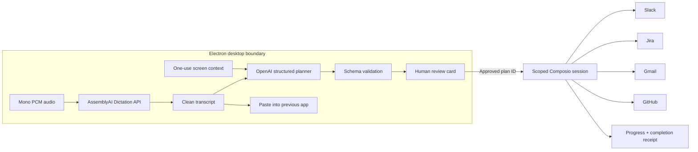

<p align="center">
  
</p>

<h1 align="center">Twin</h1>

<p align="center">
  <strong>Your voice, across your apps.</strong>
</p>

<p align="center">
  A voice interface that turns what you are looking at and what you say<br />
  into clean writing or a reviewable workflow across your work apps.
</p>

<p align="center">
  
  
  
  
</p>

---

## The idea

Voice input is fast, but most voice products stop at producing text. Work rarely stops there. A bug report becomes a GitHub issue, a Jira task, a Slack update, and sometimes an email. The user still has to copy context between tabs and explain information that is already visible on screen.

**Twin turns dictation into an intent layer for the desktop.** It combines a cleaned voice transcript with the screen the user was viewing, resolves references such as “this issue” or “tell the team,” and converts the request into a plan that can be reviewed before it touches another app.

Twin stays hidden until a global shortcut opens it. It works in two modes:

| **Dictate** | **Act** |
| --- | --- |
| Speak into any text field. Twin removes filler words and self-corrections, restores punctuation, preserves technical terms, and pastes the result into the previous app. | Describe an outcome. Twin combines the spoken request with visible context, creates a multi-app plan, and shows the exact external effect before it runs. |

The same voice interaction can therefore finish a sentence or finish a workflow.

## A complete use case

Imagine a developer reading a bug report in GitHub. Instead of opening three tools and moving the same context between them, they press the shortcut and say:

> Uh, create a Jira ticket for this login bug—actually make it high priority—link this GitHub issue, and tell the engineering channel we are investigating it.

Twin then:

1. Records the utterance as mono audio with echo cancellation and noise suppression.
2. Uses AssemblyAI to produce the final intent without the filler word or discarded correction.
3. Uses the GitHub page captured before the overlay appeared to resolve “this login bug” and “this GitHub issue.”
4. Produces a structured review card listing Jira, GitHub, and Slack as the affected apps.
5. Waits for the user to press **Run action**.
6. Executes the approved workflow and returns a step-by-step completion receipt.

Voice carries the context across the surrounding tools while the user keeps their attention on the work in front of them.

## What is novel

### One transcript, two outcomes

AssemblyAI's Dictation API returns both the original transcript and an instruction-cleaned result. Twin uses that clean result directly for writing in **Dictate** mode and as high-signal intent for planning in **Act** mode. Voice cleanup is part of the control pipeline rather than a cosmetic step after transcription.

### Commands grounded in what you see

People naturally say “this issue,” “reply to that,” and “send it to the team.” Twin captures the active display *before* showing its interface, so the overlay never obscures the source context. A compressed, one-use screen snapshot helps the planner ground those references without forcing the user to repeat what is already on screen.

### Intent is compiled before it is executed

Twin converts model output into a validated plan before any connected app becomes available. OpenAI must return a strict JSON object with a title, description, selected toolkits, operation, confirmation, readiness state, and missing details. Twin validates that contract and stores the resulting plan in the Electron main process.

The renderer receives a plan ID for review. When the user approves it, the renderer can request execution of that stored plan; it cannot submit an arbitrary tool payload. This creates a clear boundary between **understanding**, **review**, and **execution**.

### Multi-app actions remain understandable

Each approved workflow gets a temporary Composio execution session containing only the required connected toolkits. Progress is streamed back to the interface as each app is used, and the session is deleted when the workflow finishes. The result is one visible action with one receipt instead of several opaque background operations.

## Technical execution



| Layer | Implementation |
| --- | --- |
| **Desktop shell** | Electron window lifecycle, global shortcut, always-on-top overlay, multi-monitor recovery, remembered position, and transparent click-through regions |
| **Audio capture** | Web Audio API, mono recording, echo cancellation, noise suppression, live amplitude feedback, and in-process PCM-to-WAV encoding |
| **Dictation** | Multipart audio request to AssemblyAI's global Dictation API with prompts for punctuation, correction handling, names, code, URLs, and technical terms |
| **Context** | Active-display capture scaled to a maximum width of 1440 px and encoded as a low-bandwidth JPEG before the overlay is shown |
| **Planning** | OpenAI Responses API with a strict JSON Schema; plans are validated against the four allowed toolkits and held by UUID in the main process |
| **Execution** | Composio Tool Router sessions limited to the toolkits named in the approved plan, with progress events, bounded tool loops, and workflow deadlines |
| **Desktop insertion** | The overlay hides, writes the cleaned result to the clipboard, and pastes into the previously focused application |
| **Process isolation** | Context-isolated, sandboxed renderer with Node.js disabled; a typed preload bridge exposes only Twin's required IPC operations |

## AssemblyAI is the first reasoning boundary

Twin uses AssemblyAI's beta Dictation endpoint at `https://dictation.assemblyai.com/v1/transcribe/live`. Alongside the audio, it sends an instruction that asks the model to:

- remove filler words;
- resolve self-corrections to the speaker's final intent;
- add natural punctuation;
- preserve names, URLs, code, technical terms, and tone;
- return only the cleaned text.

This matters for actions as much as it does for writing. A planner should receive “make it high priority,” not both sides of “make it medium—actually high priority.” AssemblyAI removes that ambiguity before any action model sees the request.

## Safety and control

- **Nothing runs on transcription.** Act mode always stops at a review card.
- **Plans are validated.** Unsupported toolkits, incomplete plans, and malformed model responses are rejected.
- **Execution is scoped.** Each workflow can access only the approved Slack, Jira, Gmail, or GitHub toolkits.
- **Destructive tools are disabled.** Composio tools marked with destructive behavior are excluded.
- **Workflows are bounded.** Planning and execution have cancellation, step limits, and hard deadlines.
- **Secrets stay outside React.** Credentials are encrypted with Electron `safeStorage`, loaded only in the main process, and never exposed to the renderer.
- **External navigation is restricted.** Twin opens only validated HTTPS connection links.
- **Screen context is ephemeral.** The captured image is consumed by one planning request and then cleared.

## Connected work apps

| App | Example actions |
| --- | --- |
| **Slack** | Send channel updates and follow-ups |
| **Jira** | Create and update issues |
| **Gmail** | Draft and send reviewed emails |
| **GitHub** | Read repositories and work with issues or comments |

Connections are completed once during onboarding and remembered locally. A single approved request can coordinate several connected apps in sequence.

## Product details that make it feel native

- A normal one-time onboarding window becomes a compact floating bar after setup.
- The overlay can be dragged from its grip or logo and remembers its position.
- Transparent space is click-through, so Twin does not block the desktop around it.
- The window expands upward as transcripts, plans, and receipts appear, keeping the input anchored.
- If a saved position belongs to a disconnected monitor, Twin automatically returns to a visible display.
- `Escape` dismisses the overlay, and the shortcut reopens it from any app.

## Run locally

### Prerequisites

- Windows 10 or 11
- Node.js 20.19 or newer
- pnpm 10

Install dependencies:

```bash
pnpm install
```

Create `.env` from [`.env.example`](.env.example) and add your keys:

```dotenv
ASSEMBLYAI_API_KEY=
OPENAI_API_KEY=
COMPOSIO_API_KEY=
TWIN_USER_ID=local-user
OPENAI_MODEL=gpt-5-mini
```

Then start Twin:

```bash
pnpm dev
```

Complete the onboarding once, connect the work apps you want to use, and press the configured global shortcut. Twin uses `Alt+Space` by default and falls back to `Ctrl+Shift+Space` when that shortcut is unavailable.

## Validate and package

```bash
pnpm typecheck
pnpm build
pnpm package:win
```

The Windows installer is written to `release/Twin Setup 0.1.0.exe`.

## Project structure

```text
src/main/       Electron lifecycle, secure storage, global shortcut, and APIs
src/preload/    Typed bridge between Electron and the renderer
src/renderer/   Onboarding, floating interface, action review, and motion
public/         Product mark and static assets
docs/           Demo flow and project notes
```

## Demo flow

The short walkthrough in [`docs/demo.md`](docs/demo.md) covers clean dictation and a multi-app action from voice request to completion receipt.

## Why Twin fits this hackathon

Twin starts with the core promise of dictation—speaking naturally and receiving clean text—then tests what becomes possible when that transcript can understand the desktop around it. AssemblyAI is used at the moment where messy speech becomes reliable language, and every later stage builds on that output.

The result is a practical voice product with two levels of value: a feature someone can use every minute to write faster, and a deeper action layer that can compress a repetitive cross-app workflow into one reviewable interaction.

---

<p align="center">
  Built for <a href="https://luma.com/qwckwa01">Voice Hackathon Week: Hack into Dictation</a>.
</p>
